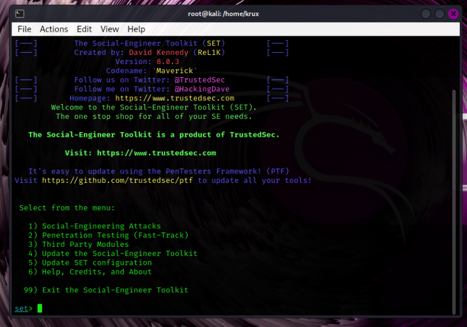
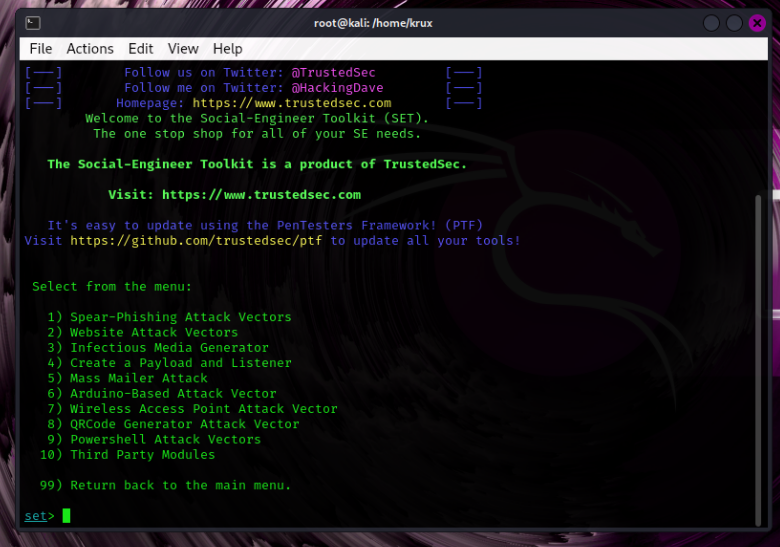
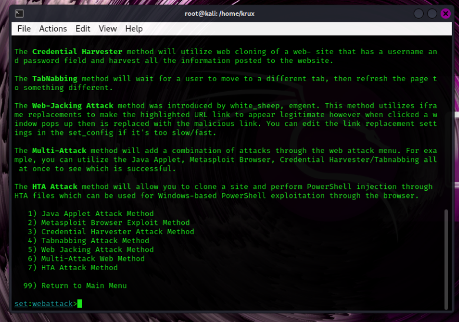
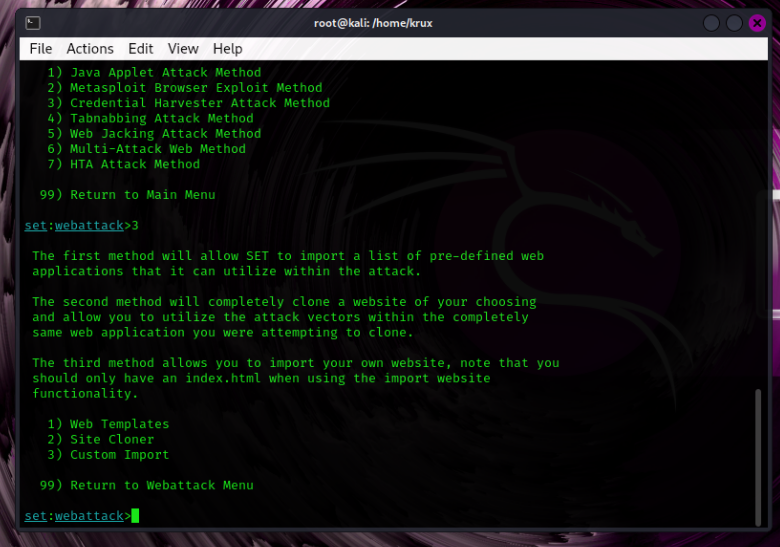
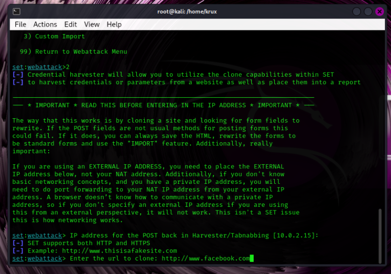
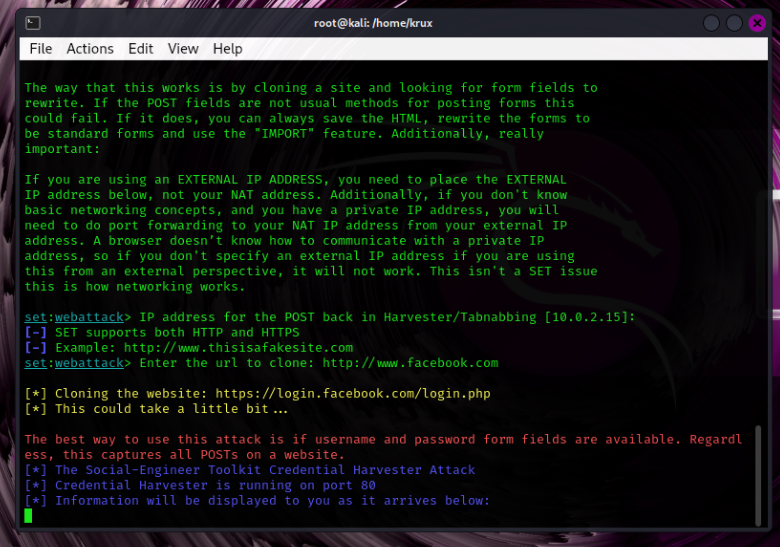
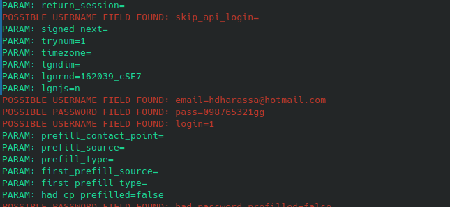

# Phishing para captura de senhas do Facebook
Este repositório apresenta um guia para configurar um ataque de phishing com o objetivo de capturar credenciais do Facebook. **Este material é exclusivamente para fins educacionais e conscientização sobre segurança cibernética. O uso indevido é estritamente proibido.**
### Pré-requisitos

- Kali Linux (Ou Distro de sua preferência)
- setoolkit

### Configurando o Phishing no Kali Linux
- Obtendo o endereço da máquina: ``` ifconfig ```


- Acesso root: ``` sudo su ```
- Inicie o setoolkit: ``` setoolkit ```
- Escolha o Tipo de ataque: ``` Social-Engineering Attacks ```
- Selecione o Vetor de ataque: ``` Web Site Attack Vectors ```
- Defina o Método de ataque: ```Credential Harvester Attack Method ```
- Método de ataque: ``` Site Cloner ```
- Insira o URL do site a ser clonado: Por exemplo: http://www.facebook.com

### Resutados














